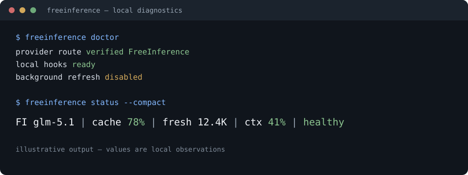

# FreeInference Companion

[](https://github.com/B-A-M-N/FreeInferenceCompanion/actions/workflows/ci.yml)
[](go.mod)
[](docs/INSTALL.md)
[](LICENSE)

Local observability and diagnostics for [FreeInference](https://freeinference.org/)
users of Claude Code and Codex.

FreeInference Companion records the lifecycle and status data the client
already exposes, then turns that data into useful local diagnostics.



*Illustrative terminal output. Values are local observations, not an
additional provider request.*

> **Trust boundary — local companion only.** No prompt interception. No
> transcript collection. No proxying. No automatic failover. No daemon.
> Normal hooks and status rendering make no provider API calls.

**Provider health · Cache diagnostics · Context pressure · Account usage ·
Sanitized support reports**

## What a user sees

An ordinary Claude Code or Codex session stays visually unchanged. A verified
FreeInference session can show local Companion information such as the model,
cache observations, context pressure, and freshness:

```text
ordinary Claude/Codex session       (no FreeInference output)
verified FreeInference Claude       FI glm-5.1 | cache 78% | ctx 41% | healthy
verified FreeInference Codex        native Codex footer + local diagnostics
```

Codex keeps ownership of its native footer and does not expose the same live
context and cache fields as Claude Code. Its Companion plugin records bounded
lifecycle state and provides diagnostic commands and skills; unavailable
values remain unavailable instead of being guessed.

## Why I made it

FreeInference gave me access to inference I otherwise would not have had. I
made this because I wanted to return something useful: a small, inspectable
tool that helps users understand the service they rely on and gives them
better, sanitized information when something goes wrong.

I also believe providing inference to the public is a vital and increasingly
necessary resource. Capable models are becoming part of writing, research,
education, software, and ordinary problem-solving, but public access is still
too easy to overlook or dismiss. Public inference gives more people room to
learn, experiment, build, and participate. Its value is often clearest only
after access disappears.

FreeInference is one example of that public resource. This project is my small
way of helping its users understand and care for it while keeping provider
traffic direct and keeping optional network behavior under the user's control.

## What it provides

- Client-observed Claude context metrics and context-pressure warnings.
- Rolling cache-pattern classification with likely diagnoses.
- Cached model health and public service status.
- Validated account-budget projection when authoritative usage data exists.
- Sanitized failure summaries and support reports.
- Claude status-line integration and Codex's native footer configuration.

Warnings are advisory. Unknown telemetry stays unknown rather than becoming a
made-up zero or an overconfident conclusion.

## Install

For normal use, download a release binary, verify its checksum, and follow
[Installation](docs/INSTALL.md).

### Claude Code

```bash
# after placing the freeinference binary on PATH
freeinference doctor
freeinference install
freeinference status-line install
```

Configure Claude Code for the documented FreeInference route in
[CLI and configuration](docs/CLI.md#client-routes), then restart Claude Code.
If a launcher uses a loopback compatibility proxy, it must also provide the
explicit `FI_PROXY_UPSTREAM_URL` attestation; a bare local URL stays silent.

### Codex

```bash
freeinference install
freeinference codex-footer install
codex plugin list --json
```

Configure the provider and profiles using [Codex with
FreeInference](docs/codex.md). Review and trust the installed hooks in Codex's
`/hooks` panel after installation.

### Manual or source installation

For a source checkout, use `make install` as described in
[Development](docs/DEVELOPMENT.md). For a manual plugin-only install, use the
marketplace commands in [Installation](docs/INSTALL.md).

Keep API keys in the environment or a secrets manager, never in a config file.

## What it does—and what it never does

The Companion is deliberately outside the inference path. It:

- records bounded lifecycle events and client-provided status metrics locally;
- shows context pressure and rolling cache-pattern diagnostics where the
  client exposes enough information;
- keeps provider metadata and public-status results cached and timestamped;
- produces sanitized status, failure, and support-report output.

It never intercepts prompts or responses, scrapes transcripts, stores
credentials, performs automatic inference probes, switches models, proxies
traffic, or runs a daemon. Ordinary Claude and Codex usage stays quiet unless
FreeInference use is explicitly verified.

Normal hooks, plugin installation, and status rendering are local-only and
cannot consume the provider's inference rate limit. `fi-status` is an explicit
unauthenticated public-status request, `doctor --probe` is an explicit manual
inference probe, and metadata refresh is disabled by default.

If `FI_AUTO_REFRESH=1` is explicitly enabled, refreshes run detached and are
limited by shared spacing, request coalescing, `Retry-After` handling,
rate-limit cooldowns, and circuit breakers. Deferred work is not accumulated
in an unbounded queue: the cache stays stale and a later safe opportunity can
retry it.

## How it fits

The client continues to send inference directly to FreeInference. The
Companion receives only the separate lifecycle/status data exposed by the
client and writes bounded local state:

```text
                         inference traffic
Claude Code / Codex ───────────────────────────────> FreeInference
       │
       │ bounded lifecycle + status data
       ▼
FreeInference Companion ──> local telemetry, cached diagnostics, reports
```

The Companion is not in the arrow between the client and the provider.

## A short example

```text
$ freeinference doctor
provider route       verified FreeInference
local hooks          ready
background refresh   disabled

$ freeinference status --compact
FI glm-5.1 | cache 78% | fresh 12.4K | ctx 41% | healthy

$ freeinference cache
pattern              intermittent
confidence           medium
diagnosis            cache behavior varies across observed turns

$ freeinference report --format markdown
sanitized report written to stdout
```

The output is illustrative. Missing client telemetry stays unknown or
unavailable, and cache diagnoses are local heuristics rather than provider
claims.

## Privacy and security

Local state contains bounded, sanitized telemetry. Prompts, responses,
transcripts, credentials, raw headers, raw error bodies, and path-shaped client
inputs are not persisted or sent by the Companion. See the full [security
model](SECURITY.md) for filesystem permissions, response limits, redaction,
report allowlists, and the trace-correlation tradeoff.

## Independent community project

> **Unofficial and independent.** FreeInference did not commission, direct,
> fund, pay for, review, or approve this project. Nothing here implies
> sponsorship, partnership, endorsement, or representation by FreeInference or
> an affiliated organization.

HarvardMadSys, if mentioned as part of the project's motivation, is not a
reviewer, approver, funder, or sponsor either.

If FreeInference is useful to you, please support FreeInference directly: read
the [official documentation](https://doc.freeinference.org/), send feedback
through its official channels, contribute where the maintainers accept
contributions, and support its work financially if they provide that option.
This Companion is meant to complement the service, not replace or impersonate
it.

## Documentation

| Topic | Documentation |
| --- | --- |
| Install and update | [Installation](docs/INSTALL.md) |
| Claude Code and CLI | [CLI and configuration](docs/CLI.md) |
| Codex setup | [Codex with FreeInference](docs/codex.md) |
| Compatibility | [Client capabilities](docs/COMPATIBILITY.md) |
| Architecture | [Local state and data flow](docs/ARCHITECTURE.md) |
| Observability | [Freshness, warnings, usage, retention](docs/OBSERVABILITY.md) |
| Cache diagnostics | [Classifications and limits](docs/CACHE_DIAGNOSTICS.md) |
| Security model | [Security and vulnerability reporting](SECURITY.md) |
| Development and release | [Development](docs/DEVELOPMENT.md) · [Releasing](docs/RELEASING.md) |

## Useful commands

```bash
freeinference status --compact
freeinference status --level detailed
freeinference models
freeinference cache
freeinference report --format markdown
freeinference fi-status --json
```

## License

MIT
